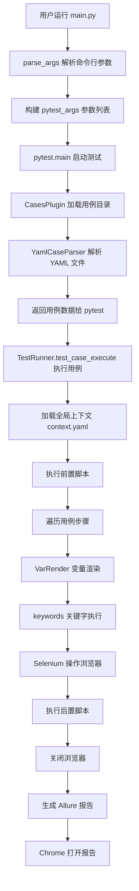

# HAT 自动化测试框架 - 小白学习指南

> 🎯 本指南从零开始，带你彻底理解华测教育自动化测试框架的架构、数据流和代码逻辑

---

## 📚 目录

1. [项目整体架构概览](#1-项目整体架构概览)
2. [目录结构详解](#2-目录结构详解)
3. [核心执行流程](#3-核心执行流程)
4. [数据流转全过程](#4-数据流转全过程)
5. [代码逻辑逐层解析](#5-代码逻辑逐层解析)
6. [快速上手实践](#6-快速上手实践)
7. [调试技巧大全](#7-调试技巧大全)
8. [常见问题与解决方案](#8-常见问题与解决方案)

---

## 1. 项目整体架构概览

### 1.1 框架定位

**HAT (Huace Auto Test)** 是一个**数据驱动 + 关键字驱动**的自动化测试框架，支持：
- ✅ Web UI 自动化（Selenium）
- ✅ API 接口自动化
- ✅ APP 自动化
- ✅ AI 辅助测试

### 1.2 核心设计理念

```
测试数据（YAML/Excel） 
    ↓
数据解析器（Parser）
    ↓
测试执行器（TestRunner）
    ↓
关键字库（Keywords）
    ↓
浏览器/App/接口
    ↓
测试报告（Allure）
```

**核心思想**：测试人员只需编写 YAML/Excel 格式的测试用例，无需写 Python 代码！

---

## 2. 目录结构详解

```
E:\CODE\web_auto/
├── main.py                    # 🚀 项目入口文件（命令行启动点）
├── setup.py                   # 📦 项目打包配置
├── requeirement.txt           # 📋 Python依赖包列表
├── run.ps1                    # ⚡ PowerShell运行脚本
├── .gitignore                 # 🔒 Git忽略文件配置
│
├── HAT/                       # 🏗️ 框架核心目录（Huace Auto Test）
│   ├── __init__.py
│   │
│   ├── core/                  # ⚙️ 核心引擎层
│   │   ├── TestRunner.py      # 🔥 测试执行器（最重要！）
│   │   ├── CasesPlugin.py     # 📥 用例加载插件
│   │   └── globalContext.py   # 🌍 全局上下文管理
│   │
│   ├── context/               # 📊 上下文管理
│   │   └── WebCaseContext.py  # Web用例上下文（浏览器初始化）
│   │
│   ├── parse/                 # 📖 用例解析层
│   │   ├── YamlCaseParser.py  # YAML用例解析器
│   │   ├── ExcelCaseParser.py # Excel用例解析器
│   │   ├── caseParser.py      # 通用解析工具
│   │   └── context_excel.yaml # Excel上下文模板
│   │
│   ├── keywords/              # 🔑 关键字层
│   │   └── web_keywords.py    # Web操作关键字封装
│   │
│   ├── key_dir/               # 🔧 自定义关键字目录
│   │   └── 输入内容.py        # 用户自定义关键字示例
│   │
│   ├── utils/                 # 🛠️ 工具类
│   │   ├── VarRender.py       # 变量渲染器（模板替换）
│   │   └── allure_step_logger.py  # Allure日志装饰器
│   │
│   ├── extend/                # 🧩 扩展功能
│   │   ├── allure_combine/    # Allure报告合并工具
│   │   └── script/            # Python脚本执行器
│   │
│   └── logs/                  # 📝 运行日志
│
├── examples/                  # 📚 测试用例示例
│   ├── web-cases-yaml/        # 📄 YAML格式用例
│   │   ├── context.yaml       # 全局配置 + 页面元素定位
│   │   ├── 0_DSW-登陆.yaml    # 登录用例
│   │   ├── 1_DSW-搜索书籍.yaml
│   │   ├── 2_DSW-加入书架.yaml
│   │   ├── 3_DSW-发布我的反馈.yaml
│   │   ├── 4_DSW-评论书籍.yaml
│   │   └── 5_DSW-后台登陆.yaml
│   │
│   ├── web-cases-excel/       # 📊 Excel格式用例
│   │   ├── context.xlsx
│   │   └── 1_WEB测试用例.xlsx
│   │
│   └── web-cases-ai/          # 🤖 AI测试用例
│
├── test-results/              # 📊 pytest原始测试结果
├── HTML测试报告/               # 📈 Allure可视化报告
└── logs/                      # 📝 框架运行日志
```

---

## 3. 核心执行流程

### 3.1 完整执行链路（重点！）



### 3.2 关键执行节点详解

#### 节点1：main.py 入口
```python
# 第34-48行：解析命令行参数
def parse_args():
    parser.add_argument('--type', default='yaml')      # 用例类型
    parser.add_argument('--cases', required=True)      # 用例路径
    parser.add_argument('--keyDir')                     # 自定义关键字
    parser.add_argument('--alluredir')                  # 测试结果目录
    parser.add_argument('--report_html_path')           # 报告目录

# 第49-104行：运行函数
def run():
    # 构建 pytest 参数
    pytest_args = ["-v", "--no-header", "-s", "--clean-alluredir"]
    pytest_args.append(f"--type={cmd_args.type}")
    pytest_args.append(f"--cases={cmd_args.cases}")
    
    # 启动 pytest
    exit_code = pytest.main(pytest_args, plugins=[CasesPlugin()])
    
    # 生成报告
    subprocess.check_output(f"allure generate ...")
    webbrowser.open("report.html")  # 打开报告
```

#### 节点2：CasesPlugin 用例发现
```python
# HAT/core/CasesPlugin.py
class CasesPlugin:
    def pytest_generate_tests(self, metafunc):
        # 1. 读取 --cases 参数指定的目录
        cases_dir = metafunc.config.getoption('--cases')
        
        # 2. 根据 --type 选择解析器
        if type == 'yaml':
            cases = load_yaml_files(cases_dir)  # 解析YAML
        else:
            cases = load_excel_files(cases_dir)  # 解析Excel
        
        # 3. 将用例数据传递给 TestRunner
        metafunc.parametrize("caseinfo", cases)
```

#### 节点3：TestRunner 执行器（核心！）
```python
# HAT/core/TestRunner.py 第24-104行
class TestRunner:
    def test_case_execute(self, caseinfo):
        """
        执行单个测试用例
        :param caseinfo: 用例数据（从YAML/Excel解析而来）
        """
        caseContext = None
        try:
            # 1. 获取用例基础配置
            base_info = caseinfo.get("基础配置")
            case_type = base_info.get('用例类型')  # WebCase / APICase / AppCase
            
            # 2. 初始化上下文（Web用例会启动浏览器）
            if case_type == 'WebCase':
                caseContext = WebCaseContext()
                keywords = caseContext.init_keywords()  # 获取关键字对象
            
            # 3. 设置 Allure 报告信息
            allure.dynamic.feature(base_info.get('一级模块'))
            allure.dynamic.story(base_info.get('二级模块'))
            allure.dynamic.title(base_info.get('用例标题'))
            
            # 4. 加载全局上下文变量
            context = copy.deepcopy(g_context().show_dict())
            context.update(local_context)  # 合并DDT数据
            
            # 5. 执行前置脚本
            pre_script = refresh(caseinfo.get("前置脚本", None), context)
            if pre_script:
                for script in eval(pre_script):
                    run_script.exec_script(script, g_context().show_dict())
            
            # 6. 遍历用例步骤（核心循环！）
            steps = caseinfo.get("用例步骤")
            for step in steps:
                step_name = list(step.keys())[0]      # 步骤名称
                step_value = list(step.values())[0]   # 步骤数据
                
                # 7. 变量渲染（替换 {{username}} 等模板）
                context = copy.deepcopy(g_context().show_dict())
                context.update(local_context)
                step_value = eval(refresh(step_value, context))
                
                # 8. 执行关键字
                with allure_step_with_log(step_name):
                    key = step_value['操作类型']  # 如：访问网址、输入内容、点击元素
                    key_func = keywords.__getattribute__(key)
                    key_func(**step_value)
            
            # 9. 执行后置脚本
            post_script = refresh(caseinfo.get("后置脚本", None), context)
            if post_script:
                for script in eval(post_script):
                    run_script.exec_script(script, g_context().show_dict())
        
        finally:
            # 10. 关闭浏览器（无论如何都会执行）
            if caseContext is not None:
                caseContext.release()
```

#### 节点4：关键字执行
```python
# HAT/keywords/web_keywords.py
class Keywords:
    def 访问网址(self, **kwargs):
        """访问网址关键字"""
        self.driver.get(kwargs['网址'])
        self.get_screenshot()  # 截图
    
    def 输入内容(self, **kwargs):
        """输入内容关键字"""
        eles_list = self.find_element(**kwargs)
        eles_list.clear()
        eles_list.send_keys(kwargs['数据内容'])
        self.get_screenshot()
    
    def 点击元素(self, **kwargs):
        """点击元素关键字"""
        eles_list = self.find_element(**kwargs)
        eles_list.click()
        self.get_screenshot()
    
    def find_element(self, **kwargs):
        """查找元素（核心定位方法）"""
        all_ele_data = g_context().get_dict('_WEB页面元素')
        key = str(kwargs['_页面元素'])
        ele_data = all_ele_data[key]  # 从 context.yaml 获取定位信息
        
        locator_type = ele_data['定位方式']  # id, xpath, css selector 等
        locator_value = ele_data['目标对象']
        
        locator = (locator_type, locator_value)
        return self.wait_for_element(locator)  # 等待元素出现
```

---

## 4. 数据流转全过程

### 4.1 数据流转图

```
用户编写 YAML 用例
    ↓
context.yaml（全局配置）
    ↓
YamlCaseParser（解析器）
    ↓
Python 字典对象
    ↓
CasesPlugin（用例插件）
    ↓
pytest 参数化
    ↓
TestRunner.test_case_execute（执行器）
    ↓
VarRender（变量渲染器）
    ↓
Keywords（关键字）
    ↓
Selenium（浏览器操作）
    ↓
Allure（测试报告）
```

### 4.2 具体数据流转示例

#### 示例：登录用例数据流

**步骤1：用户编写 YAML**
```yaml
# examples/web-cases-yaml/0_DSW-登陆.yaml
基础配置:
  用例类型: WebCase
  一级模块: 我的登陆
  用例标题: 登陆测试用例

用例步骤:
- 进入到登录页面:
    操作类型: 访问网址
    网址: http://novel.hctestedu.com/user/login.html

- 输入用户名:
    操作类型: 输入内容
    数据内容: '{{username}}'  # 模板变量
    _页面元素: 手机号_输入框

数据驱动:
  - username: 15574113907
    password: 123456
    expect: http://novel.hctestedu.com/
```

**步骤2：context.yaml 提供页面元素**
```yaml
# examples/web-cases-yaml/context.yaml
username: '15574113907'  # 全局变量

_WEB页面元素:
  手机号_输入框:
    定位方式: id
    目标对象: txtUName
  密码_输入框:
    定位方式: id
    目标对象: txtPassword
  登陆_按钮:
    定位方式: id
    目标对象: btnLogin
```

**步骤3：解析为 Python 对象**
```python
caseinfo = {
    '基础配置': {
        '用例类型': 'WebCase',
        '一级模块': '我的登陆',
        '用例标题': '登陆测试用例'
    },
    '用例步骤': [
        {
            '进入到登录页面': {
                '操作类型': '访问网址',
                '网址': 'http://novel.hctestedu.com/user/login.html'
            }
        },
        {
            '输入用户名': {
                '操作类型': '输入内容',
                '数据内容': '{{username}}',
                '_页面元素': '手机号_输入框'
            }
        }
    ],
    '数据驱动': [
        {
            'username': '15574113907',
            'password': '123456',
            'expect': 'http://novel.hctestedu.com/'
        }
    ]
}
```

**步骤4：变量渲染**
```python
# VarRender 替换模板变量
step_value = {
    '操作类型': '输入内容',
    '数据内容': '{{username}}',  # 模板
    '_页面元素': '手机号_输入框'
}

# 渲染后
step_value = {
    '操作类型': '输入内容',
    '数据内容': '15574113907',  # 已替换
    '_页面元素': '手机号_输入框'
}
```

**步骤5：执行关键字**
```python
# 调用 Keywords.输入内容()
keywords.输入内容(
    操作类型='输入内容',
    数据内容='15574113907',
    _页面元素='手机号_输入框'
)

# 内部执行流程：
# 1. 从 context.yaml 获取定位信息
ele_data = {
    '定位方式': 'id',
    '目标对象': 'txtUName'
}

# 2. 定位元素
element = driver.find_element(By.ID, 'txtUName')

# 3. 输入内容
element.clear()
element.send_keys('15574113907')

# 4. 截图
screenshot()
```

---

## 5. 代码逻辑逐层解析

### 5.1 入口层：main.py

**职责**：解析命令行参数，启动 pytest

**关键代码**：
```python
# 第34-48行：参数解析
def parse_args():
    parser.add_argument('--type', default='yaml')
    parser.add_argument('--cases', required=True)
    return parser.parse_args()

# 第49-104行：运行逻辑
def run():
    # 构建 pytest 参数
    pytest_args = ["-v", "-s", "--clean-alluredir"]
    pytest_args.append(f"--cases={cmd_args.cases}")
    
    # 启动测试
    pytest.main(pytest_args, plugins=[CasesPlugin()])
    
    # 生成报告
    subprocess.run("allure generate ...")
    webbrowser.open("report.html")
```

### 5.2 插件层：CasesPlugin.py

**职责**：发现并加载测试用例

**关键代码**：
```python
class CasesPlugin:
    def pytest_addoption(self, parser):
        """注册自定义参数"""
        parser.addoption('--type', default='yaml')
        parser.addoption('--cases')
    
    def pytest_generate_tests(self, metafunc):
        """用例参数化"""
        cases_dir = metafunc.config.getoption('--cases')
        case_type = metafunc.config.getoption('--type')
        
        # 根据类型加载用例
        if case_type == 'yaml':
            cases = load_yaml_files(cases_dir)
        else:
            cases = load_excel_files(cases_dir)
        
        # 参数化传递给 TestRunner
        metafunc.parametrize("caseinfo", cases)
```

### 5.3 解析层：YamlCaseParser.py

**职责**：解析 YAML 文件为 Python 对象

**关键代码**：
```python
def load_yaml_files(cases_dir):
    """加载目录下所有 YAML 用例"""
    all_cases = []
    
    # 1. 加载全局上下文
    context_file = os.path.join(cases_dir, 'context.yaml')
    if os.path.exists(context_file):
        context = load_context_from_yaml(context_file)
        g_context().update_dict(context)
    
    # 2. 遍历 YAML 文件
    for file in os.listdir(cases_dir):
        if file.endswith('.yaml') and file != 'context.yaml':
            file_path = os.path.join(cases_dir, file)
            cases = read_yaml(file_path)
            
            # 3. 解析用例数据
            case_data = yaml_case_parser(cases)
            all_cases.extend(case_data)
    
    return all_cases

def yaml_case_parser(cases):
    """解析单个 YAML 文件"""
    base_info = cases.get('基础配置')
    steps = cases.get('用例步骤')
    ddt_data = cases.get('数据驱动', [])
    
    # 如果有数据驱动，展开为多个用例
    if ddt_data:
        expanded_cases = []
        for ddt in ddt_data:
            case = {
                '基础配置': base_info,
                '用例步骤': steps,
                'local_context': ddt  # 数据驱动数据
            }
            expanded_cases.append(case)
        return expanded_cases
    else:
        return [{'基础配置': base_info, '用例步骤': steps}]
```

### 5.4 执行层：TestRunner.py（核心！）

**职责**：执行测试用例的每一步

**关键代码**：
```python
class TestRunner:
    def test_case_execute(self, caseinfo):
        """执行单个用例"""
        try:
            # 1. 初始化
            base_info = caseinfo.get("基础配置")
            caseContext = WebCaseContext()
            keywords = caseContext.init_keywords()
            
            # 2. 设置 Allure 报告
            allure.dynamic.title(base_info.get('用例标题'))
            
            # 3. 执行前置脚本
            pre_script = caseinfo.get("前置脚本")
            if pre_script:
                for script in eval(pre_script):
                    run_script.exec_script(script, g_context().show_dict())
            
            # 4. 遍历步骤
            for step in caseinfo.get("用例步骤"):
                step_name = list(step.keys())[0]
                step_value = list(step.values())[0]
                
                # 5. 变量渲染
                context = copy.deepcopy(g_context().show_dict())
                step_value = eval(refresh(step_value, context))
                
                # 6. 执行关键字
                key = step_value['操作类型']
                key_func = keywords.__getattribute__(key)
                key_func(**step_value)
            
            # 7. 执行后置脚本
            post_script = caseinfo.get("后置脚本")
            if post_script:
                for script in eval(post_script):
                    run_script.exec_script(script, g_context().show_dict())
        
        finally:
            # 8. 清理资源
            if caseContext:
                caseContext.release()
```

### 5.5 关键字层：web_keywords.py

**职责**：封装 Selenium 操作

**关键代码**：
```python
class Keywords:
    def __init__(self, driver):
        self.driver = driver
    
    def 访问网址(self, **kwargs):
        """访问网址"""
        self.driver.get(kwargs['网址'])
        self.get_screenshot()
    
    def 输入内容(self, **kwargs):
        """输入内容"""
        element = self.find_element(**kwargs)
        element.clear()
        element.send_keys(kwargs['数据内容'])
        self.get_screenshot()
    
    def 点击元素(self, **kwargs):
        """点击元素"""
        element = self.find_element(**kwargs)
        element.click()
        self.get_screenshot()
    
    def find_element(self, **kwargs):
        """查找元素"""
        # 1. 从全局上下文获取元素定位信息
        all_ele_data = g_context().get_dict('_WEB页面元素')
        ele_data = all_ele_data[kwargs['_页面元素']]
        
        # 2. 构建定位器
        locator_type = {
            'id': By.ID,
            'xpath': By.XPATH,
            'css selector': By.CSS_SELECTOR
        }[ele_data['定位方式']]
        
        locator = (locator_type, ele_data['目标对象'])
        
        # 3. 等待元素出现
        return self.wait_for_element(locator)
    
    def wait_for_element(self, locator, timeout=10):
        """等待元素出现"""
        element = WebDriverWait(self.driver, timeout).until(
            EC.presence_of_element_located(locator)
        )
        return element
    
    def get_screenshot(self):
        """截图"""
        screenshot_path = f"screenshots/{time.time()}.png"
        self.driver.save_screenshot(screenshot_path)
        allure.attach.file(screenshot_path, name="截图", attachment_type=allure.attachment_type.PNG)
```

### 5.6 上下文层：WebCaseContext.py

**职责**：管理浏览器实例

**关键代码**：
```python
class WebCaseContext:
    def __init__(self):
        """初始化浏览器"""
        # 从 context.yaml 读取浏览器配置
        browser_config = g_context().get_dict('_浏览器')
        
        options = webdriver.ChromeOptions()
        if browser_config.get('options'):
            for arg in browser_config['options'].get('args', []):
                options.add_argument(arg)
        
        self.driver = webdriver.Chrome(options=options)
        self.driver.maximize_window()
        self.driver.implicitly_wait(10)
    
    def init_keywords(self):
        """初始化关键字对象"""
        return Keywords(self.driver)
    
    def release(self):
        """释放资源（关闭浏览器）"""
        if self.driver:
            self.driver.quit()
```

### 5.7 工具层：VarRender.py

**职责**：变量模板渲染

**关键代码**：
```python
import re
from jinja2 import Template

def refresh(data, context):
    """
    渲染模板变量
    :param data: 包含 {{变量名}} 的数据
    :param context: 变量上下文
    :return: 渲染后的数据
    """
    if isinstance(data, dict):
        result = {}
        for key, value in data.items():
            result[key] = refresh(value, context)
        return result
    
    elif isinstance(data, list):
        return [refresh(item, context) for item in data]
    
    elif isinstance(data, str):
        # 使用 Jinja2 模板引擎
        if '{{' in data and '}}' in data:
            template = Template(data)
            return template.render(**context)
        return data
    
    return data
```

---

## 6. 快速上手实践

### 6.1 环境准备

```bash
# 1. 安装依赖
pip install -r requeirement.txt -i https://pypi.tuna.tsinghua.edu.cn/simple

# 2. 安装 Chrome 浏览器
# 下载：https://www.google.com/chrome/

# 3. 安装 Allure
# 下载：https://github.com/allure-framework/allure2/releases
# 配置环境变量
```

### 6.2 运行第一个测试

```bash
# 运行所有 YAML 用例
python main.py --type=yaml --cases=examples/web-cases-yaml

# 运行指定目录的 Excel 用例
python main.py --type=excel --cases=examples/web-cases-excel

# 添加自定义关键字
python main.py --type=yaml --cases=examples/web-cases-yaml --keyDir=HAT/key_dir
```

### 6.3 编写你的第一个用例

**步骤1：编辑 context.yaml**
```yaml
# examples/web-cases-yaml/context.yaml

_USERNAME: admin
_PASSWORD: 123456

_WEB页面元素:
  用户名输入框:
    定位方式: id
    目标对象: username
  密码输入框:
    定位方式: id
    目标对象: password
  登录按钮:
    定位方式: xpath
    目标对象: //button[text()='登录']
```

**步骤2：创建测试用例**
```yaml
# examples/web-cases-yaml/my_first_case.yaml

基础配置:
  用例类型: WebCase
  一级模块: 登录模块
  二级模块: 正常登录
  用例标题: 用户名密码正确登录成功

用例步骤:
- 打开登录页面:
    操作类型: 访问网址
    网址: http://example.com/login

- 输入用户名:
    操作类型: 输入内容
    数据内容: '{{_USERNAME}}'
    _页面元素: 用户名输入框

- 输入密码:
    操作类型: 输入内容
    数据内容: '{{_PASSWORD}}'
    _页面元素: 密码输入框

- 点击登录按钮:
    操作类型: 点击元素
    _页面元素: 登录按钮

- 验证登录成功:
    操作类型: 断言浏览器路径
    数据内容: http://example.com/home
```

**步骤3：运行测试**
```bash
python main.py --type=yaml --cases=examples/web-cases-yaml
```

### 6.4 数据驱动测试

```yaml
# examples/web-cases-yaml/login_ddt.yaml

基础配置:
  用例类型: WebCase
  一级模块: 登录模块
  用例标题: 登录功能数据驱动测试

用例步骤:
- 打开登录页面:
    操作类型: 访问网址
    网址: http://example.com/login

- 输入用户名:
    操作类型: 输入内容
    数据内容: '{{username}}'
    _页面元素: 用户名输入框

- 输入密码:
    操作类型: 输入内容
    数据内容: '{{password}}'
    _页面元素: 密码输入框

- 点击登录按钮:
    操作类型: 点击元素
    _页面元素: 登录按钮

- 验证结果:
    操作类型: 断言浏览器路径
    数据内容: '{{expect_url}}'

数据驱动:
  - username: admin
    password: 123456
    expect_url: http://example.com/home
    描述标题: 正常登录
  
  - username: admin
    password: wrong_password
    expect_url: http://example.com/login
    描述标题: 密码错误
  
  - username: ''
    password: 123456
    expect_url: http://example.com/login
    描述标题: 用户名为空
```

### 6.5 使用前置/后置脚本

```yaml
# examples/web-cases-yaml/advanced_case.yaml

基础配置:
  用例类型: WebCase
  一级模块: 高级测试
  用例标题: 使用前置后置脚本

前置脚本:
  - "g_context().update_dict({'token': 'abc123'})"
  - "import requests; g_context().update_dict({'api_data': requests.get('http://api.com/data').json()})"

用例步骤:
- 打开页面:
    操作类型: 访问网址
    网址: http://example.com

- 使用前置脚本数据:
    操作类型: 输入内容
    数据内容: '{{token}}'
    _页面元素: 输入框

后置脚本:
  - "print('测试完成，清理数据')"
  - "import os; os.remove('temp_file.txt')"
```

---

## 7. 调试技巧大全

### 7.1 命令行调试

```bash
# 1. 使用 pdb 调试
python -m pdb main.py --type=yaml --cases=examples/web-cases-yaml

# 调试命令：
# n  - 单步执行（不进入函数）
# s  - 单步执行（进入函数）
# c  - 继续执行
# b  - 设置断点
# p  - 打印变量
# q  - 退出

# 2. 在代码中添加断点
# 在 main.py 第80行添加
breakpoint()  # Python 3.7+
# 或
import pdb; pdb.set_trace()

# 3. 只运行特定用例
python main.py --type=yaml --cases=examples/web-cases-yaml -k "登陆"
```

### 7.2 PyCharm 调试

**步骤1：配置运行配置**
1. 打开 PyCharm → Run → Edit Configurations
2. 添加 Python 配置
3. Script path: `E:\CODE\web_auto\main.py`
4. Parameters: `--type=yaml --cases=examples/web-cases-yaml`
5. 勾选 "Run with Python console"

**步骤2：设置断点**
- 在代码行号左侧点击，出现红点

**步骤3：启动调试**
- 点击 Debug 按钮（虫子图标）
- 使用 F8（单步）、F7（进入）、F9（继续）

### 7.3 日志调试

```bash
# 1. 查看框架日志
cat logs/hat_2026_04_11_*.log

# 2. 提高日志级别
export HAT_LOG_LEVEL=DEBUG
python main.py --type=yaml --cases=examples/web-cases-yaml

# 3. 在用例中添加调试步骤
用例步骤:
- 调试打印:
    操作类型: 执行脚本
    脚本: "print('当前变量:', g_context().show_dict())"
```

### 7.4 浏览器调试

```python
# 在 context.yaml 中开启浏览器可视化
_浏览器:
  capability:
    browserName: chrome
  options:
    args: []  # 移除 headless，显示浏览器

# 添加等待时间观察执行
用例步骤:
- 强制等待:
    操作类型: 强制等待
    数据内容: '5'
```

### 7.5 变量调试

```yaml
# 打印变量值
用例步骤:
- 打印全局变量:
    操作类型: 执行脚本
    脚本: "import json; print(json.dumps(g_context().show_dict(), ensure_ascii=False, indent=2))"

- 打印当前步骤数据:
    操作类型: 执行脚本
    脚本: "print('step_value:', {{_current_step}})"
```

---

## 8. 常见问题与解决方案

### 8.1 环境问题

**Q1：提示找不到 allure 命令**
```bash
# 解决方案
# 1. 下载 Allure：https://github.com/allure-framework/allure2/releases
# 2. 解压到 D:\allure-2.20.1
# 3. 添加到环境变量 PATH
# 4. 重启终端验证
allure --version
```

**Q2：Chrome 浏览器无法启动**
```bash
# 解决方案
# 1. 确保安装了 Chrome 浏览器
# 2. 升级 Selenium 到最新版本
pip install --upgrade selenium

# 3. 或者手动下载 ChromeDriver
# https://chromedriver.chromium.org/downloads
```

**Q3：依赖安装失败**
```bash
# 解决方案：使用国内镜像
pip install -r requeirement.txt -i https://pypi.tuna.tsinghua.edu.cn/simple
```

### 8.2 用例执行问题

**Q4：元素定位失败**
```python
# 解决方案：
# 1. 检查 context.yaml 中的定位器是否正确
# 2. 使用 Chrome DevTools 验证 XPath/CSS
# 3. 增加等待时间

用例步骤:
- 等待元素加载:
    操作类型: 强制等待
    数据内容: '3'

- 点击元素:
    操作类型: 点击元素
    _页面元素: 目标按钮
```

**Q5：变量渲染失败**
```python
# 解决方案：
# 1. 检查变量名是否拼写正确
# 2. 确认变量在 context.yaml 中已定义
# 3. 使用调试脚本打印变量

前置脚本:
  - "print('可用变量:', g_context().show_dict().keys())"
```

**Q6：用例执行顺序不对**
```python
# 解决方案：
# YAML 文件按字母顺序执行，可在文件名前加数字前缀
# 0_登录.yaml
# 1_搜索.yaml
# 2_加入购物车.yaml
```

### 8.3 报告问题

**Q7：Allure 报告无法打开**
```bash
# 解决方案：
# 1. 检查报告文件是否生成
ls HTML测试报告/report.html

# 2. 手动打开
allure open HTML测试报告

# 3. 或者直接双击 report.html
```

**Q8：报告截图不显示**
```python
# 解决方案：
# 检查截图路径是否正确
# 确保 allure 有权限访问截图目录
```

### 8.4 性能问题

**Q9：用例执行太慢**
```python
# 优化方案：
# 1. 减少强制等待时间
# 2. 使用显式等待替代隐式等待
# 3. 并发执行用例（需要额外配置）

_浏览器:
  options:
    args:
      - "headless"  # 无头模式加速
```

**Q10：内存占用过高**
```python
# 解决方案：
# 1. 确保每个用例结束后关闭浏览器
# 2. 定期清理 screenshots 目录
# 3. 分批执行大量用例
```

---

## 🎓 学习路径建议

### 第一阶段：理解框架（1-2天）
- [ ] 阅读本指南第1-3章
- [ ] 理解目录结构和执行流程
- [ ] 运行示例用例，观察执行过程

### 第二阶段：动手实践（2-3天）
- [ ] 编写第一个简单用例
- [ ] 学习使用数据驱动
- [ ] 尝试前置/后置脚本

### 第三阶段：深入理解（3-5天）
- [ ] 阅读核心代码（TestRunner.py、web_keywords.py）
- [ ] 理解数据流转过程
- [ ] 学习调试技巧

### 第四阶段：扩展应用（持续）
- [ ] 编写自定义关键字
- [ ] 集成到 CI/CD 流程
- [ ] 优化用例结构和数据

---

## 📞 获取帮助

- **框架文档**：查看 README.md
- **示例用例**：参考 examples/ 目录
- **问题反馈**：联系华测教育技术支持
- **在线课程**：http://vip.hctestedu.com

---

**祝你学习顺利！🎉**
